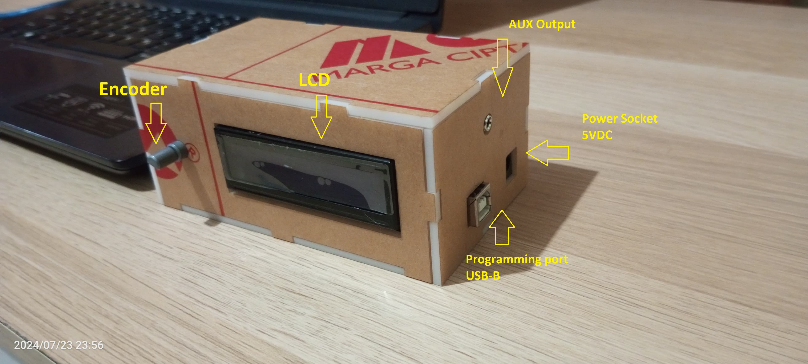
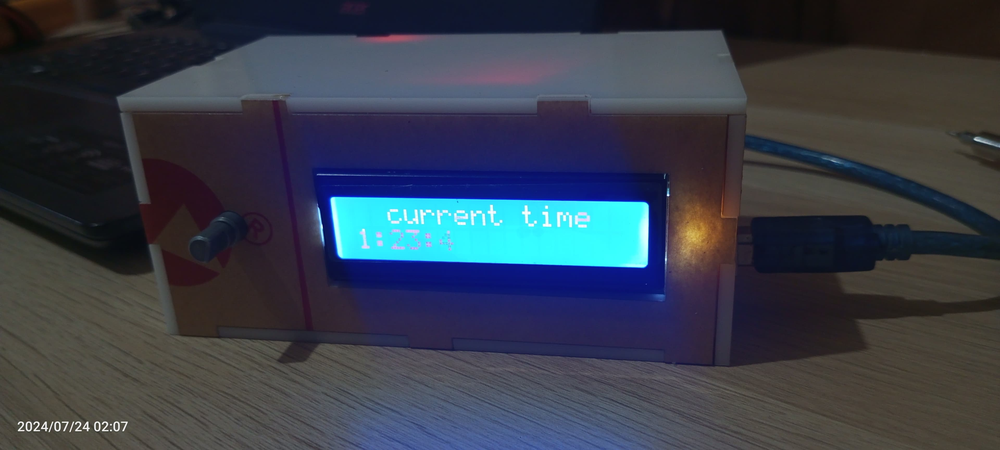
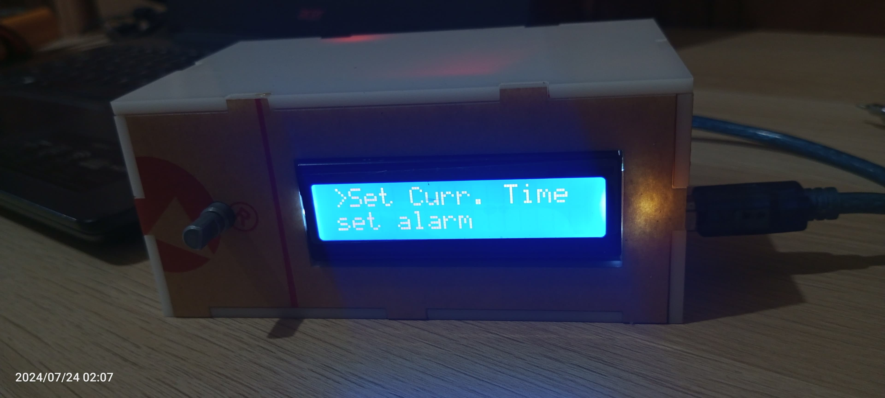
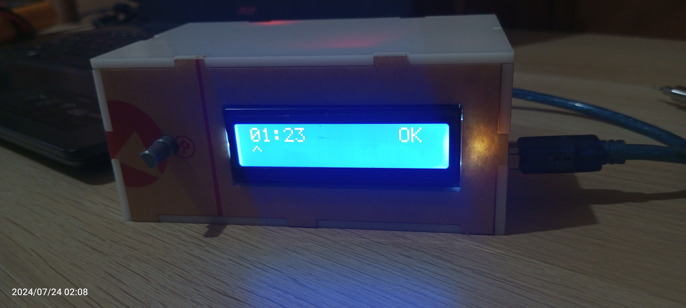
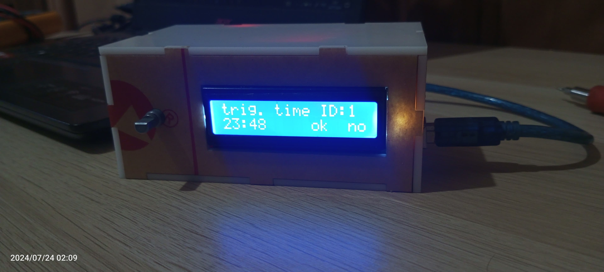

# Alarm Clock ⏰
💡 This project is used to provide alarms or notifications according to the preset time that has been entered before.
### Finish Overview

## Setup ⚙️
1. On home screen push the encoder until it displayed menu list.
 
   

"This is home screen."

2. in menu list you can start rotating the encoder to select option you want and press encoder again to enter it.

"Menu List."

3. Select "__Set curr. Time__" to change current time configuraion.
   3.1 . Rotate Encoder "__clockwise__" to increase the value and vice versa.
   3.2 . Push encoder to move to next option.

"Set Current Time."

4. Select "__Set alarm__" to make configuration when the specific voice willl be played.
   4.1 Rotate Encoder "__clockwise__" to increase the value and vice versa.
   4.2 3.2 . Push encoder to move to next option.

"Set Track."

   
"**__Note__**" : ID mean if you set track with ID:1 at 23:00 then voiceline number 1 will be played at that time.

5. Select "__back__" to return to previous page.

